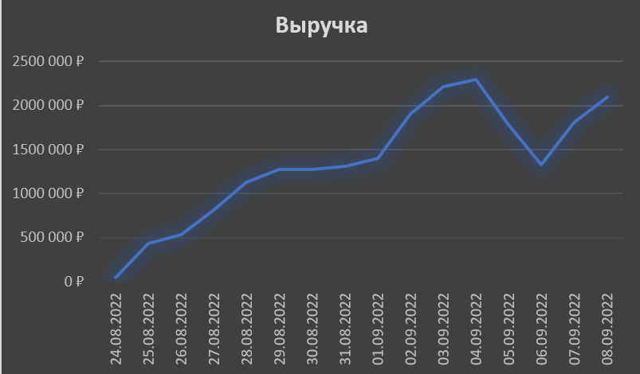

# Задача №2. Ежедневная выручка сервиса.

## 📌 Постановка 
Определить, как меняется выручка сервиса день за днем?

## 🛠 Решение
**Что сделала:**
- через CTE оставила только неотмененные пользователями заказы;
- в таблице с информацией о заказе развернула список айди товаров каждого заказа через UNNEST;
- присоединила таблицу products через LEFT JOIN по ключу айди товара для получения цены каждого товара;
- привела время создания заказа к типу DATE и сгруппировала данные по дням при помощи GROUP BY;
- посчитала сумму цен всех заказов за каждый день через агрегирующую функцию SUM().

## 📊 Результат

| Дата | Выручка |
|-------|-------------------|
| 24.08.2022 |	49 924 ₽ |
| 25.08.2022 |	430 860 ₽ |
| 26.08.2022 |	534 766 ₽ |
| 27.08.2022 |	817 053 ₽ |
| 28.08.2022 |	1 133 370 ₽ |
| 29.08.2022 |	1 279 891 ₽ |
| 30.08.2022 |	1 279 377 ₽ |
| 31.08.2022 |	1 312 720 ₽ |
| 01.09.2022 |	1 406 101 ₽ |
| 02.09.2022 |	1 907 107 ₽ |
| 03.09.2022 |	2 210 988 ₽ |
| 04.09.2022 |	2 294 009 ₽ |
| 05.09.2022 |	1 784 690 ₽ |
| 06.09.2022 |	1 330 931 ₽ |
| 07.09.2022 |	1 807 800 ₽ |
| 08.09.2022 |	2 099 508 ₽ |

Получены данные ежедневной выручки, на основе которых построен график в BI инструменте.

